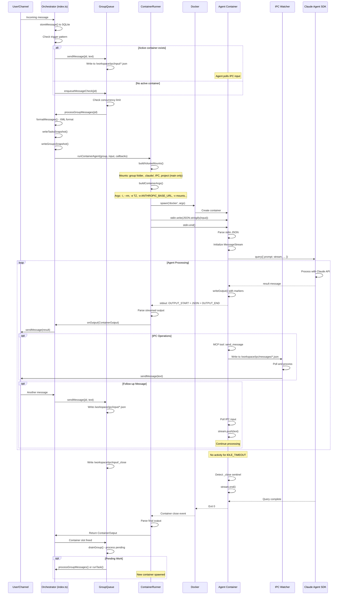

# NanoClaw Runtime Interface Analysis

Generated: 2026-03-13

---

## 1. FILE INVENTORY

### Core Orchestrator Files (src/)

| File | Purpose | Lines |
|------|---------|-------|
| `src/index.ts` | Main orchestrator: state management, message loop, agent invocation, channel coordination, startup/shutdown | 598 |
| `src/container-runner.ts` | Container lifecycle: spawns Docker containers, builds mounts, handles I/O streaming, output parsing | 707 |
| `src/container-runtime.ts` | Container runtime abstraction: binary name, host gateway, proxy binding, orphan cleanup | 127 |
| `src/ipc.ts` | IPC watcher: polls for messages/tasks from containers, authorization checks, task CRUD | 455 |
| `src/db.ts` | SQLite operations: messages, chats, sessions, tasks, registered groups, router state | 697 |
| `src/group-queue.ts` | Concurrency manager: per-group task queuing, container pooling, retry logic | 365 |
| `src/task-scheduler.ts` | Scheduled task runner: cron/interval/once scheduling, next-run computation | 282 |
| `src/credential-proxy.ts` | API credential injection: HTTP proxy for container→Anthropic API requests | 125 |
| `src/router.ts` | Message formatting: XML message construction, internal tag stripping | 52 |
| `src/config.ts` | Configuration: paths, timeouts, trigger patterns, timezone | 73 |
| `src/types.ts` | Type definitions: RegisteredGroup, Channel, NewMessage, ScheduledTask | 107 |
| `src/mount-security.ts` | Mount validation: allowlist enforcement, blocked patterns, path validation | 419 |
| `src/sender-allowlist.ts` | Sender filtering: trigger/drop modes, per-chat allowlists | 128 |
| `src/group-folder.ts` | Path security: group folder validation, traversal prevention | 44 |
| `src/env.ts` | Environment file parser: reads .env without polluting process.env | 42 |
| `src/logger.ts` | Pino logger configuration with pretty printing | 16 |
| `src/timezone.ts` | Timestamp formatting with timezone support | 16 |

### Channel System (src/channels/)

| File | Purpose | Lines |
|------|---------|-------|
| `src/channels/registry.ts` | Channel registry: factory registration, lookup | 28 |
| `src/channels/index.ts` | Barrel import for auto-registration | 12 |

### Container Agent (container/agent-runner/src/)

| File | Purpose | Lines |
|------|---------|-------|
| `container/agent-runner/src/index.ts` | Agent runner: stdin/stdout protocol, Claude SDK integration, IPC polling, session management | 558 |
| `container/agent-runner/src/ipc-mcp-stdio.ts` | MCP server: send_message, schedule_task, register_group tools | 338 |

### Setup Scripts (setup/)

| File | Purpose | Lines |
|------|---------|-------|
| `setup/index.ts` | Setup entry point | 58 |
| `setup/service.ts` | systemd/launchd service configuration | 361 |
| `setup/platform.ts` | Platform detection (macOS, Linux, WSL) | 132 |
| `setup/container.ts` | Container runtime detection and validation | 144 |
| `setup/groups.ts` | Group initialization and migration | 229 |
| `setup/register.ts` | Main group registration flow | 177 |
| `setup/environment.ts` | Environment file generation | 94 |
| `setup/mounts.ts` | Mount allowlist setup | 115 |
| `setup/verify.ts` | Installation verification | 192 |
| `setup/status.ts` | Status display utilities | 16 |

### Test Files

| File | Purpose | Lines |
|------|---------|-------|
| `src/db.test.ts` | Database operation tests | 484 |
| `src/group-queue.test.ts` | Queue concurrency tests | 484 |
| `src/ipc-auth.test.ts` | IPC authorization tests | 678 |
| `src/container-runner.test.ts` | Container runner tests | 210 |
| `src/container-runtime.test.ts` | Runtime abstraction tests | 149 |
| `src/credential-proxy.test.ts` | Credential proxy tests | 192 |
| `src/sender-allowlist.test.ts` | Sender filtering tests | 216 |
| `src/task-scheduler.test.ts` | Scheduler tests | 129 |
| `src/routing.test.ts` | Message routing tests | 170 |
| `src/formatting.test.ts` | Message formatting tests | 256 |
| `src/timezone.test.ts` | Timezone formatting tests | 29 |
| `src/group-folder.test.ts` | Path security tests | 43 |
| `src/channels/registry.test.ts` | Channel registry tests | 42 |
| `setup/service.test.ts` | Service configuration tests | 176 |
| `setup/platform.test.ts` | Platform detection tests | 120 |
| `setup/register.test.ts` | Registration flow tests | 257 |
| `setup/environment.test.ts` | Environment setup tests | 121 |

### Build/Config Files

| File | Purpose | Lines |
|------|---------|-------|
| `container/build.sh` | Container image build script | 24 |
| `container/Dockerfile` | Agent container image definition | 71 |
| `vitest.config.ts` | Test configuration | 7 |
| `vitest.skills.config.ts` | Skills test configuration | 7 |
| `scripts/run-migrations.ts` | Database migration runner | 105 |

**Total Source Lines (excluding tests): ~4,800**
**Total Lines (including tests): ~10,582**

---

## 2. CONTAINER RUNTIME MODULE

### Primary Files

#### `src/container-runtime.ts` (Lines 1-127)

**Runtime Configuration (Lines 1-41)**
```
Line 12: CONTAINER_RUNTIME_BIN = 'docker'
Line 15: CONTAINER_HOST_GATEWAY = 'host.docker.internal'
Lines 23-41: PROXY_BIND_HOST detection (macOS loopback, Linux docker0 bridge)
```

**Host Gateway Args (Lines 43-50)**
```
Lines 44-49: hostGatewayArgs() - adds --add-host=host.docker.internal:host-gateway on Linux
```

**Readonly Mount Args (Lines 52-58)**
```
Lines 53-57: readonlyMountArgs() - returns ['-v', 'host:container:ro']
```

**Container Stop (Lines 60-63)**
```
Lines 61-62: stopContainer() - returns 'docker stop {name}'
```

**Runtime Startup Check (Lines 65-101)**
```
Lines 66-100: ensureContainerRuntimeRunning() - execSync('docker info'), fatal error if unavailable
```

**Orphan Cleanup (Lines 103-127)**
```
Lines 104-126: cleanupOrphans() - lists containers with name=nanoclaw-, stops them
```

#### `src/container-runner.ts` (Lines 1-707)

**Container Creation (Lines 215-265)**
```
Lines 215-265: buildContainerArgs()
  - Line 219: ['run', '-i', '--rm', '--name', containerName]
  - Line 222: -e TZ=${TIMEZONE}
  - Lines 225-227: -e ANTHROPIC_BASE_URL=http://${CONTAINER_HOST_GATEWAY}:${CREDENTIAL_PROXY_PORT}
  - Lines 234-239: Auth mode detection (api-key or oauth placeholder)
  - Lines 242-252: Host UID/GID mapping for bind mount permissions
  - Lines 254-260: Volume mount generation
  - Line 262: Image name argument
```

**Container Start & Exec (Lines 267-643)**
```
Lines 267-272: runContainerAgent() signature
Lines 309-312: Container spawn with stdio: ['pipe', 'pipe', 'pipe']
Lines 321: stdin.write(JSON.stringify(input)) - sends ContainerInput
Lines 322: stdin.end()
Lines 329-378: stdout streaming with OUTPUT_MARKER parsing
Lines 381-401: stderr logging
Lines 410-433: Timeout handling with configurable CONTAINER_TIMEOUT
Lines 435-628: Container 'close' event handling, output parsing, session management
Lines 630-641: Container 'error' event handling
```

**Container Stop (Lines 410-424)**
```
Lines 410-424: killOnTimeout() - exec(stopContainer(containerName)), falls back to SIGKILL
```

**Mount Configuration (Lines 59-213)**
```
Lines 59-213: buildVolumeMounts()
  Lines 67-77: Main group gets project root read-only at /workspace/project
  Lines 79-88: .env file shadowed with /dev/null
  Lines 91-95: Group folder at /workspace/group (read-write)
  Lines 97-113: Non-main groups get own folder + global (read-only)
  Lines 116-164: Per-group .claude/ sessions directory
  Lines 166-176: Per-group IPC directory at /workspace/ipc
  Lines 181-200: Agent-runner source at /app/src
  Lines 202-210: Additional mounts from containerConfig (validated)
```

**Environment Variable Injection (Lines 221-252)**
```
Line 222: TZ timezone
Lines 225-227: ANTHROPIC_BASE_URL (credential proxy)
Lines 235-239: ANTHROPIC_API_KEY or CLAUDE_CODE_OAUTH_TOKEN (placeholder values)
Lines 247-252: Host UID/GID and HOME
```

**IPC Mechanism**

The IPC uses filesystem-based communication:

Host → Container:
- Input: stdin JSON with ContainerInput (prompt, sessionId, groupFolder, chatJid, isMain)
- Follow-up messages: JSON files in `/workspace/ipc/input/*.json`
- Close signal: `/workspace/ipc/input/_close` sentinel file

Container → Host:
- Output: stdout with `---NANOCLAW_OUTPUT_START---` / `---NANOCLAW_OUTPUT_END---` markers
- Messages: JSON files in `/workspace/ipc/messages/*.json`
- Task commands: JSON files in `/workspace/ipc/tasks/*.json`

**IPC JSON Schemas:**

ContainerInput (stdin):
```json
{
  "prompt": "string",
  "sessionId": "string | undefined",
  "groupFolder": "string",
  "chatJid": "string",
  "isMain": "boolean",
  "isScheduledTask": "boolean | undefined",
  "assistantName": "string | undefined"
}
```

ContainerOutput (stdout):
```json
{
  "status": "'success' | 'error'",
  "result": "string | null",
  "newSessionId": "string | undefined",
  "error": "string | undefined"
}
```

IPC Message (messages/*.json):
```json
{
  "type": "message",
  "chatJid": "string",
  "text": "string",
  "sender": "string | undefined",
  "groupFolder": "string",
  "timestamp": "string (ISO)"
}
```

IPC Task (tasks/*.json):
```json
{
  "type": "'schedule_task' | 'pause_task' | 'resume_task' | 'cancel_task' | 'update_task' | 'refresh_groups' | 'register_group'",
  "taskId": "string | undefined",
  "prompt": "string | undefined",
  "schedule_type": "'cron' | 'interval' | 'once'",
  "schedule_value": "string",
  "context_mode": "'group' | 'isolated'",
  "targetJid": "string | undefined",
  "jid": "string | undefined",
  "name": "string | undefined",
  "folder": "string | undefined",
  "trigger": "string | undefined"
}
```

---

## 3. INTERFACE CONTRACT

```typescript
/**
 * Container Runtime Driver Interface
 *
 * This interface abstracts the container runtime (Docker, Apple Container, etc.)
 * allowing the orchestrator to remain runtime-agnostic.
 */

/** The container runtime binary name (e.g., 'docker', 'container') */
export const CONTAINER_RUNTIME_BIN: string;

/** Hostname containers use to reach the host machine */
export const CONTAINER_HOST_GATEWAY: string;

/** Address the credential proxy binds to */
export const PROXY_BIND_HOST: string;

/**
 * Returns CLI arguments needed for the container to resolve the host gateway.
 * On Linux, adds --add-host=host.docker.internal:host-gateway
 * On macOS/Docker Desktop, returns empty array (built-in)
 */
export function hostGatewayArgs(): string[];

/**
 * Returns CLI arguments for a readonly bind mount.
 * @param hostPath - Absolute path on host filesystem
 * @param containerPath - Target path inside container
 * @returns ['-v', 'hostPath:containerPath:ro']
 */
export function readonlyMountArgs(hostPath: string, containerPath: string): string[];

/**
 * Returns the shell command to stop a container by name.
 * @param name - Container name (e.g., 'nanoclaw-main-1234567890')
 * @returns 'docker stop {name}'
 */
export function stopContainer(name: string): string;

/**
 * Ensure the container runtime is available and running.
 * Throws Error if runtime is not available (fatal for orchestrator startup).
 */
export function ensureContainerRuntimeRunning(): void;

/**
 * Kill orphaned NanoClaw containers from previous runs.
 * Filters containers by name prefix 'nanoclaw-' and stops them.
 */
export function cleanupOrphans(): void;

// --- Container Runner Types ---

/** Input passed to container via stdin JSON */
export interface ContainerInput {
  /** User prompt / formatted messages */
  prompt: string;
  /** Existing Claude session ID for continuation */
  sessionId?: string;
  /** Group folder name (e.g., 'main', 'telegram_team') */
  groupFolder: string;
  /** Chat/group JID for routing responses */
  chatJid: string;
  /** Whether this is the main control group */
  isMain: boolean;
  /** Whether this is a scheduled task (adds prefix to prompt) */
  isScheduledTask?: boolean;
  /** Assistant name for display */
  assistantName?: string;
}

/** Output from container via stdout JSON */
export interface ContainerOutput {
  /** Execution status */
  status: 'success' | 'error';
  /** Agent response text (null for intermediate markers) */
  result: string | null;
  /** New session ID if session was created */
  newSessionId?: string;
  /** Error message if status is 'error' */
  error?: string;
}

/** Volume mount specification */
interface VolumeMount {
  /** Absolute path on host */
  hostPath: string;
  /** Path inside container */
  containerPath: string;
  /** Whether mount is read-only */
  readonly: boolean;
}

/**
 * Build volume mounts for a container based on group configuration.
 * @param group - Registered group configuration
 * @param isMain - Whether this is the main control group
 * @returns Array of volume mount specifications
 */
declare function buildVolumeMounts(
  group: RegisteredGroup,
  isMain: boolean
): VolumeMount[];

/**
 * Build Docker CLI arguments for container creation.
 * @param mounts - Volume mounts to include
 * @param containerName - Unique name for the container
 * @returns Array of CLI arguments for 'docker run'
 */
declare function buildContainerArgs(
  mounts: VolumeMount[],
  containerName: string
): string[];

/**
 * Run an agent inside a container.
 *
 * @param group - Registered group configuration
 * @param input - Container input (prompt, session, etc.)
 * @param onProcess - Callback when container process is spawned
 * @param onOutput - Optional streaming callback for each output marker
 * @returns Promise resolving to final container output
 */
export function runContainerAgent(
  group: RegisteredGroup,
  input: ContainerInput,
  onProcess: (proc: ChildProcess, containerName: string) => void,
  onOutput?: (output: ContainerOutput) => Promise<void>
): Promise<ContainerOutput>;

/**
 * Write tasks snapshot for container to read.
 * @param groupFolder - Target group folder
 * @param isMain - Whether group is main (sees all tasks)
 * @param tasks - Array of task summaries
 */
export function writeTasksSnapshot(
  groupFolder: string,
  isMain: boolean,
  tasks: Array<{
    id: string;
    groupFolder: string;
    prompt: string;
    schedule_type: string;
    schedule_value: string;
    status: string;
    next_run: string | null;
  }>
): void;

/** Available group information */
export interface AvailableGroup {
  /** Chat/group JID */
  jid: string;
  /** Display name */
  name: string;
  /** Last activity timestamp */
  lastActivity: string;
  /** Whether group is registered */
  isRegistered: boolean;
}

/**
 * Write available groups snapshot for container to read.
 * @param groupFolder - Target group folder
 * @param isMain - Whether group is main (can see all groups)
 * @param groups - Array of available groups
 * @param registeredJids - Set of already-registered JIDs
 */
export function writeGroupsSnapshot(
  groupFolder: string,
  isMain: boolean,
  groups: AvailableGroup[],
  registeredJids: Set<string>
): void;

// --- Registered Group Types ---

/** Additional mount configuration */
export interface AdditionalMount {
  /** Absolute path on host (supports ~ for home) */
  hostPath: string;
  /** Target path inside container (default: basename) */
  containerPath?: string;
  /** Read-only flag (default: true) */
  readonly?: boolean;
}

/** Per-group container configuration */
export interface ContainerConfig {
  /** Additional host directories to mount */
  additionalMounts?: AdditionalMount[];
  /** Container timeout in milliseconds (default: 300000) */
  timeout?: number;
}

/** Registered group definition */
export interface RegisteredGroup {
  /** Display name */
  name: string;
  /** Folder name for isolation */
  folder: string;
  /** Trigger pattern (e.g., '@Andy') */
  trigger: string;
  /** Registration timestamp */
  added_at: string;
  /** Container configuration overrides */
  containerConfig?: ContainerConfig;
  /** Whether trigger is required (default: true for groups) */
  requiresTrigger?: boolean;
  /** Whether this is the main control group */
  isMain?: boolean;
}
```

---

## 4. ORCHESTRATOR CALL SITES

### Container Runtime Imports

| File:Line | Description |
|-----------|-------------|
| `src/index.ts:26-28` | Import `cleanupOrphans`, `ensureContainerRuntimeRunning`, `PROXY_BIND_HOST` from container-runtime |
| `src/container-runner.ts:21-27` | Import `CONTAINER_HOST_GATEWAY`, `CONTAINER_RUNTIME_BIN`, `hostGatewayArgs`, `readonlyMountArgs`, `stopContainer` from container-runtime |

### Container Runtime Calls

| File:Line | Call | Description |
|-----------|------|-------------|
| `src/index.ts:463-466` | `ensureContainerSystemRunning()` calls `ensureContainerRuntimeRunning()` then `cleanupOrphans()` | Startup: verify Docker is running, clean up orphaned containers |
| `src/index.ts:475-478` | `startCredentialProxy(CREDENTIAL_PROXY_PORT, PROXY_BIND_HOST)` | Start credential proxy on runtime-detected bind address |
| `src/container-runner.ts:242` | `hostGatewayArgs()` | Get runtime-specific args for host gateway resolution |
| `src/container-runner.ts:256` | `readonlyMountArgs(mount.hostPath, mount.containerPath)` | Build readonly mount CLI args |
| `src/container-runner.ts:310` | `spawn(CONTAINER_RUNTIME_BIN, containerArgs, ...)` | Spawn container process |
| `src/container-runner.ts:416` | `exec(stopContainer(containerName), ...)` | Stop container on timeout |

### runContainerAgent Calls

| File:Line | Context | Description |
|-----------|---------|-------------|
| `src/index.ts:309-322` | `runAgent()` function | Invoke container for message processing with streaming output callback |
| `src/task-scheduler.ts:172-200` | `runTask()` function | Invoke container for scheduled task execution with streaming output callback |

### Container Process Registration

| File:Line | Call | Description |
|-----------|------|-------------|
| `src/index.ts:319-320` | `queue.registerProcess(chatJid, proc, containerName, group.folder)` | Register spawned process with queue for tracking |
| `src/index.ts:548-549` | `queue.registerProcess(groupJid, proc, containerName, groupFolder)` | Register process via scheduler onProcess callback |
| `src/task-scheduler.ts:183-184` | `deps.onProcess(task.chat_jid, proc, containerName, task.group_folder)` | Register process for task container |

### IPC Snapshot Writes

| File:Line | Call | Description |
|-----------|------|-------------|
| `src/index.ts:273-286` | `writeTasksSnapshot(group.folder, isMain, tasks.map(...))` | Write tasks before agent invocation |
| `src/index.ts:289-295` | `writeGroupsSnapshot(group.folder, isMain, availableGroups, ...)` | Write groups before agent invocation |
| `src/index.ts:576-577` | `writeGroupsSnapshot(gf, im, ag, rj)` | Write groups via IPC watcher callback |
| `src/task-scheduler.ts:135-147` | `writeTasksSnapshot(task.group_folder, isMain, tasks.map(...))` | Write tasks before task execution |

### Container Queue Management

| File:Line | Call | Description |
|-----------|------|-------------|
| `src/index.ts:229` | `queue.notifyIdle(chatJid)` | Mark container as idle after success |
| `src/index.ts:418` | `queue.sendMessage(chatJid, formatted)` | Pipe follow-up message to active container |
| `src/index.ts:434` | `queue.enqueueMessageCheck(chatJid)` | Queue new container if none active |
| `src/index.ts:458` | `queue.enqueueMessageCheck(chatJid)` | Queue recovery on startup |
| `src/index.ts:484` | `queue.shutdown(10000)` | Graceful shutdown |
| `src/index.ts:579` | `queue.setProcessMessagesFn(processGroupMessages)` | Set message processing callback |
| `src/task-scheduler.ts:167` | `deps.queue.closeStdin(task.chat_jid)` | Close container stdin after task |
| `src/task-scheduler.ts:193-194` | `deps.queue.notifyIdle(task.chat_jid)` | Mark task container as idle |
| `src/task-scheduler.ts:265` | `deps.queue.enqueueTask(currentTask.chat_jid, currentTask.id, ...)` | Queue due task for execution |

---

## 5. NATIVE DEPENDENCIES

### Host Dependencies (package.json)

| Package | Version | Native | FreeBSD Notes |
|---------|---------|--------|---------------|
| `better-sqlite3` | ^11.8.1 | **Yes** (C++ SQLite binding) | Requires compilation. May need `npm rebuild better-sqlite3` with FreeBSD-compatible toolchain. Pre-built binaries available for Linux/macOS only. |
| `@anthropic-ai/sdk` | ^0.78.0 | No | Pure JavaScript |
| `cron-parser` | ^5.5.0 | No | Pure JavaScript |
| `pino` | ^9.6.0 | No | Pure JavaScript (uses native `process.stdout`) |
| `pino-pretty` | ^13.0.0 | No | Pure JavaScript |
| `yaml` | ^2.8.2 | No | Pure JavaScript |
| `zod` | ^4.3.6 | No | Pure JavaScript |

### Container Agent Dependencies (container/agent-runner/package.json)

| Package | Version | Native | Notes |
|---------|---------|--------|-------|
| `@anthropic-ai/claude-agent-sdk` | ^0.2.34 | No | Pure JavaScript (runs inside Linux container) |
| `@modelcontextprotocol/sdk` | ^1.12.1 | No | Pure JavaScript |
| `cron-parser` | ^5.0.0 | No | Pure JavaScript |
| `zod` | ^4.0.0 | No | Pure JavaScript |

### FreeBSD Compatibility Issues

1. **better-sqlite3** (HIGH RISK)
   - Requires C++ compilation with node-gyp
   - Depends on: `python3`, `make`, `g++` or `clang`
   - FreeBSD notes:
     - Install build tools: `pkg install python3 gmake`
     - May need `CXX=clang++` environment variable
     - Pre-built binaries not available; must compile from source
     - Test: `npm rebuild better-sqlite3` after package installation

2. **pino** (LOW RISK)
   - Pure JavaScript, but uses `sonic-boom` which has optional native optimization
   - Falls back to JavaScript implementation if native unavailable
   - No action required

3. **Container Runtime**
   - NanoClaw spawns Docker containers
   - Docker on FreeBSD requires `docker-freebsd` or running Docker in a Linux jail/VM
   - Alternative: Use bhyve-based Docker or Linux compatibility layer
   - The `CONTAINER_RUNTIME_BIN` constant (`src/container-runtime.ts:12`) can be overridden

### Recommended FreeBSD Installation Steps

```bash
# Install build dependencies
pkg install python3 gmake node22 npm

# Clone and install
git clone https://github.com/qwibitai/nanoclaw.git
cd nanoclaw

# Build native modules
npm install
npm rebuild better-sqlite3  # Explicit rebuild if needed

# Container runtime (choose one):
# Option A: Linux jail with Docker
# Option B: bhyve VM with Docker
# Option C: Podman (set CONTAINER_RUNTIME_BIN=podman)
```

---

## 6. AGENT LIFECYCLE



### Lifecycle Phases

1. **Message Arrival** (src/index.ts:353-442)
   - Channel delivers message via `onMessage` callback
   - Message stored in SQLite
   - Trigger pattern checked for non-main groups
   - If container active: pipe via IPC; else: enqueue

2. **Container Creation** (src/container-runner.ts:267-312)
   - GroupQueue checks concurrency limit (MAX_CONCURRENT_CONTAINERS)
   - Build volume mounts based on group config
   - Build Docker CLI arguments with env vars
   - Spawn container with stdio pipes

3. **Agent Execution** (container/agent-runner/src/index.ts:467-556)
   - Read ContainerInput from stdin
   - Create MessageStream for SDK
   - Call Claude Agent SDK `query()` with streaming
   - Process results, emit OUTPUT_MARKER pairs

4. **IPC Communication**
   - Agent → Host: JSON files in `/workspace/ipc/messages/` or `/workspace/ipc/tasks/`
   - Host → Agent: JSON files in `/workspace/ipc/input/`
   - Session termination: `_close` sentinel file

5. **Response Delivery** (src/index.ts:210-235)
   - Runner parses OUTPUT_MARKER pairs
   - Calls `onOutput` callback with each result
   - Orchestrator sends via channel

6. **Cleanup** (src/container-runner.ts:435-628)
   - Container exits (success, timeout, or error)
   - Session ID persisted if changed
   - Queue slot freed
   - Pending work drained

### Key Timeouts

| Timeout | Default | Config | Purpose |
|---------|---------|--------|---------|
| CONTAINER_TIMEOUT | 1800000 (30min) | `CONTAINER_TIMEOUT` env / `containerConfig.timeout` | Max container runtime |
| IDLE_TIMEOUT | 1800000 (30min) | `IDLE_TIMEOUT` env | Time to keep container alive after last output |
| IPC_POLL_INTERVAL | 1000 (1s) | Hardcoded | IPC watcher polling interval |
| POLL_INTERVAL | 2000 (2s) | Hardcoded | Message loop polling interval |
| SCHEDULER_POLL_INTERVAL | 60000 (1min) | Hardcoded | Task scheduler polling interval |

---

## Appendix: Key File Relationships

```
┌─────────────────────────────────────────────────────────────────────────┐
│                            HOST ORCHESTRATOR                             │
├─────────────────────────────────────────────────────────────────────────┤
│  index.ts                                                                │
│    ├── channels/registry.ts  → Channel abstraction                      │
│    ├── container-runner.ts   → Container lifecycle                      │
│    │     └── container-runtime.ts  → Docker/runtime abstraction         │
│    ├── credential-proxy.ts   → API credential injection                 │
│    ├── group-queue.ts        → Concurrency management                   │
│    ├── ipc.ts                → IPC message processing                   │
│    ├── task-scheduler.ts     → Scheduled task execution                 │
│    ├── db.ts                 → SQLite persistence                       │
│    └── router.ts             → Message formatting                       │
├─────────────────────────────────────────────────────────────────────────┤
│                          CONTAINER (Docker)                              │
├─────────────────────────────────────────────────────────────────────────┤
│  container/agent-runner/src/                                             │
│    ├── index.ts              → Agent main loop, SDK integration         │
│    └── ipc-mcp-stdio.ts      → MCP server for IPC tools                 │
│                                                                          │
│  Mounts:                                                                 │
│    /workspace/group    ← groups/{folder}/                                │
│    /workspace/global   ← groups/global/ (read-only, non-main only)       │
│    /workspace/project  ← project root (read-only, main only)             │
│    /workspace/ipc      ← data/ipc/{folder}/                              │
│    /workspace/extra/*  ← additional mounts from containerConfig          │
│    /home/node/.claude  ← data/sessions/{folder}/.claude/                 │
│    /app/src            ← data/sessions/{folder}/agent-runner-src/        │
└─────────────────────────────────────────────────────────────────────────┘
```
